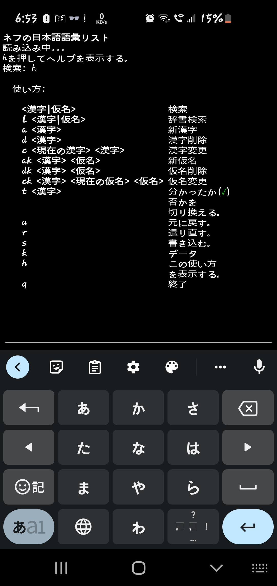
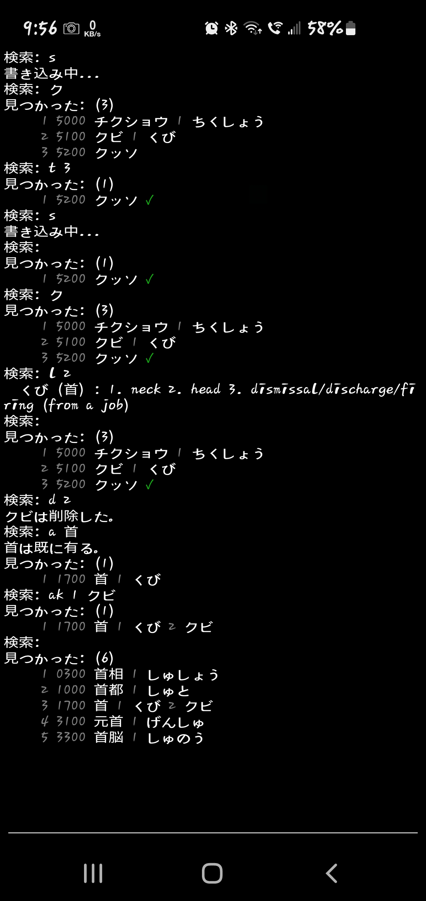
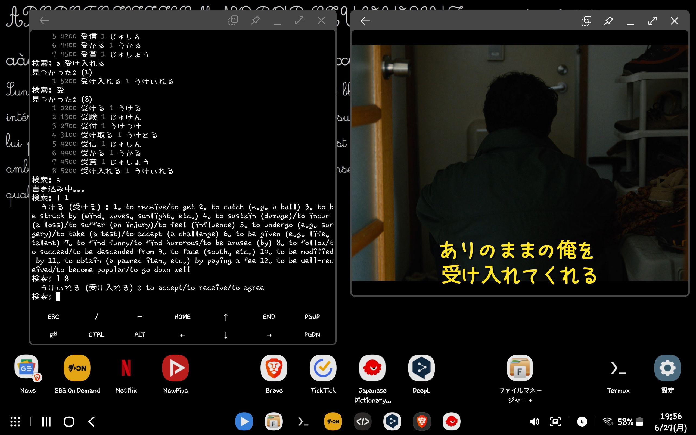

# Nev's Japanese Vocab

## What Is This?

This is a Python terminal application that I use on my phone and tablet to manage Japanese vocabulary that I am learning. I've used various Android apps but I wanted something that does exactly what I require, and I have zero interest in App development. 😉

It is Python 3 with strict typing, full tests, full undo/redo, is localised in Japanese, English, French, and Spanish, it uses [Pykakasi](https://github.com/miurahr/pykakasi) for kanji to kana conversion, and [Jamdict](https://github.com/neocl/jamdict) for English dictionary lookups. Its feature set is just exactly what I personally need, I need even fewer Android apps.

**NOTE: I don't expect anyone to use this, you have to be a terminal nut for a start. This repo and these instructions are for my own use.**

So why is it localised in four different languages? They are just the languages I speak, and in the case of Japanese am learning.

## Vocabulary

The original list is Kanshudo's top 5000 words by usefulness, stripped of hiragana only words, and now augmented with my own words from books, movies, and TV programs.

Reference: https://www.kanshudo.com/collections/vocab_usefulness2021

## Setup on Linux

1. Standard dev environment, VS Code, all my extensions, Python 3, `entr`, `gettext`, and `sed`.
2. The Python packages and tools listed below.
3. Added VS Code's settings: `"python.linting.banditArgs": ["--ini=${workspaceFolder}/.bandit"],` It has a `.vscode/launch.json` and `.bandit` for VSCode.

## Setup On Android

1. Install [Termux](https://f-droid.org/en/packages/com.termux/) from F-Droid.
2. Install [Termux Widget](https://f-droid.org/en/packages/com.termux.widget/) from F-Droid.
3. Install [Code Editor](https://play.google.com/store/apps/details?id=com.rhmsoft.code).
4. `pkg update`
5. `pkg install entr git python`
6. `termux-setup-storage`
7. `ssh-keygen`
8. `cat .ssh/id_rsa.pub # Copy it into GitHub.`
9. `mkdir -p ~/.shortcuts`
10. `chmod 700 ~/.shortcuts`
11. `cd ~/storage/shared/`
12. `git clone git@github.com:nevdelap/nevsjapanesevocab.git`
13. `cd nevsjapanesevocab`
14. `bash install_termux`
15. `pip install --upgrade wheel`
16. `pip install --upgrade ansicolors bandit black isort jamdict jamdict-data mypy pykakasi pylint pytest pyupgrade readline`
17. Create a Termux Widget to run `~/.shortcuts/vocab`

## Setup on Flex OS.

1. In addition to the above packages I found I needed, `sudo apt-get install libncurses5-dev`.

## Usage

You need to know how to use a Japanese keyboard, on a phone, tablet or computer, or use an IME for a computer, otherwise the usage is there, in Japanese, English, French, and Spanish. Use 'h' to read it.

If anyone want's to tell me better translations than I have in the program's UI, I'd sure appreciate it. 🙂

The usage doesn't describe some features of indexing the search results and referring to the last search, because describing it is beyond my Japanese. They are for driving it fast on the Android device where you don't have a full keyboard. I'll add descriptions of it in the other languages sometime.

```
ネフの日本語語彙リスト
読み込み中...

使い方:
     漢字｜仮名　　　　　検索
  l  日本語｜英語　　　　和英辞書で検索する。
  a  漢字　　　　　　　　新漢字
  d  漢字　　　　　　　　漢字削除
  c  漢字　新漢字　　　　漢字変更
  ak 漢字　仮名　　　　　新仮名
  dk 漢字　仮名　　　　　仮名削除
  ck 漢字　仮名　新仮名　仮名変更
  t  漢字　　　　　　　　分かったか✓否かを切り換える。
  u  　　　　　　　　　　元に戻す。
  r  　　　　　　　　　　遣り直す。
  s  　　　　　　　　　　書き込む。
  i  　　　　　　　　　　データ
  en 　　　　　　　　　　English
  es 　　　　　　　　　　español
  fr 　　　　　　　　　　français
  ja 　　　　　　　　　　日本語
  h  　　　　　　　　　　この使い方を表示する。
  q  　　　　　　　　　　終了

検索: 一口
何も見つからない。
検索: a 一口
見つかった: (1)
     1 5300 一口 1 ひとくち
検索:   そうそう
何も見つからない。
検索: a
使い方: a 漢字
検索: a         そうそう
見つかった: (1)
     1 5300 そうそう
検索: いや
見つかった: (7)
     1 0900 契約 1 けいやく
     2 1100 嫌 1 いや
     3 2400 平野 1 へいや
     4 3000 制約 1 せいやく
     5 4400 英訳 1 えいやく
     6 4600 嫌になる 1 いやになる
     7 5200 災厄 1 さいやく
検索: l 2
  いや (嫌) : disagreeable/detestable/unpleasant/reluctant
検索: お帰りなさい
何も見つからない。
検索: a お帰りなさい
見つかった: (1)
     1 5300 お帰りなさい 1 おかえりなさい
検索: l 大学院
  だいがくいん (大学院) : graduate school
検索: 申
見つかった: (7)
     1 1700 申請 1 しんせい
     2 2600 申し上げる 1 もうしあげる
     3 3400 申し込み 1 もうしこみ
     4 3400 申し込む 1 もうしこむ
     5 3800 申し訳 1 もうしわけ
     6 4000 申告 1 しんこく
     7 4700 申す 1 もうす
検索: 勤め
見つかった: (2)
     1 4200 勤め 1 つとめ
     2 5300 勤める 1 つとめる
検索: l 2
  つとめる (勤める) : 1. to work (for)/to be employed (at)/to serve (in) 2. to serve (as)/to act (as)/to fill (the position of)/to play the role (of) 3. to conduct a religious service
検索:   社会
見つかった: (1)
     1 0200 社会 1 しゃかい ✓
検索: l 1
  しゃかい (社会) : 1. society/public/community/the world 2. social studies
検索: t 1
見つかった: (1)
     1 0200 社会 1 しゃかい
検索: 社会学
何も見つからない。
検索: a 社会学
見つかった: (1)
     1 5300 社会学 1 しゃかいがく
検索: s
読み込み中...
検索: _
```

The screenshots at the moment are from before it's been localised.





