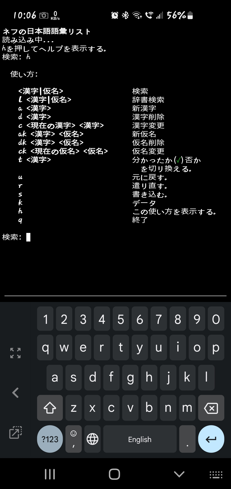

# Nev's Japanese Vocab

## What Is This?

This is a Python terminal application that I use on my phone and tablet to manage Japanese vocabulary that I am learning. I've used various Android apps but I wanted something that does exactly what I require, and I have zero interest in App development. ;)

It is Python 3 with tests, full undo/redo, and uses Pykakasi for kanji to kana conversion. Its feature set is just exactly what I personally need.

**NOTE: I don't expect anyone to use this. This repo and these instructions are for my own use.**

## Vocabulary

The original list is Kanshudo's top 5000 words by usefulness, stripped of hiragana only words, and now augmented with my own words from books, movies, and TV programs.

Reference: https://www.kanshudo.com/collections/vocab_usefulness2021

## Installation

This is my setup, the bits relevant to this at least.

1. Install [Termux](https://f-droid.org/en/packages/com.termux/) from F-Droid.
1. Install [Termux Widget](https://f-droid.org/en/packages/com.termux.widget/) from F-Droid.
1. Install [Code Editor](https://play.google.com/store/apps/details?id=com.rhmsoft.code).
1. `pkg update`
1. `pkg install git python`
1. `termux-setup-storage`
1. `ssh-keygen`
1. `cat .ssh/id_rsa.pub # Copy it into GitHub.`
1. `mkdir -p ~/.shortcuts`
1. `chmod 700 ~/.shortcuts`
1. `cd ~/storage/shared/`
1. `git clone git@bitbucket.org:nevdelap/nevsjapanesevocab.git`
1. `cd nevsjapanesevocab`
1. `bash install_termux`
1. `pip install --upgrade ansicolors autopep8 jamdict jamdict-data pykakasi unittest-data-provider wheel`
1. Create a Termux Widget to run `.shortcuts/vocab`

## Other

1. When editing on the computer I add this to VS Code's settings: `"python.linting.banditArgs": ["--ini=${workspaceFolder}/.bandit"],` It has a `.vscode/launch.json` and `.bandit` for VSCode.
1. The `watch_tests` script requires `entr`.

## Usage

You need to know how to use a Japanese keyboard, on a phone, tablet or computer, or use an IME for a computer, otherwise the usage is there, in Japanese.

If anyone want's to tell me better translations than I have in the program's UI, I'd sure appreciate it. :)

